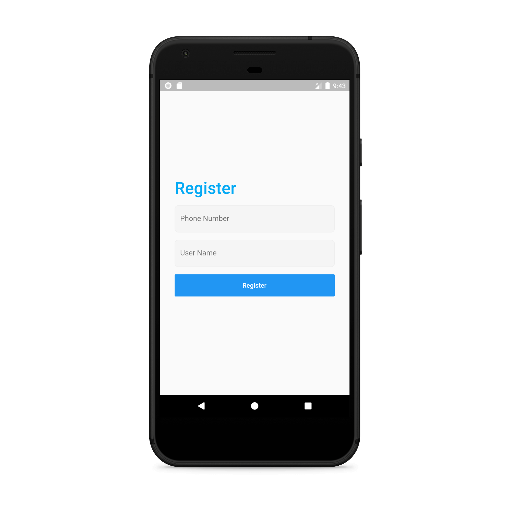
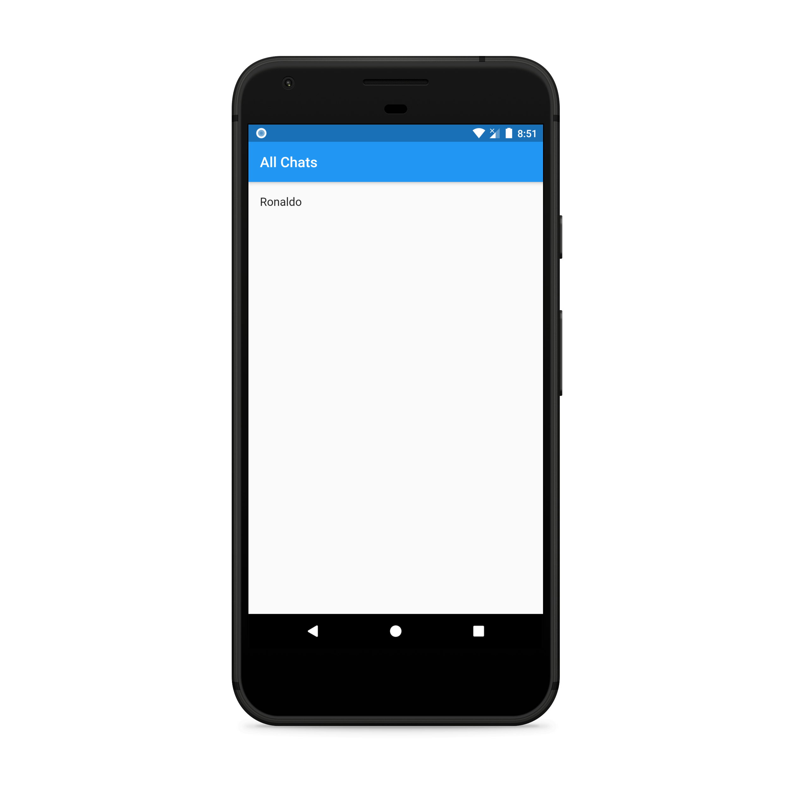
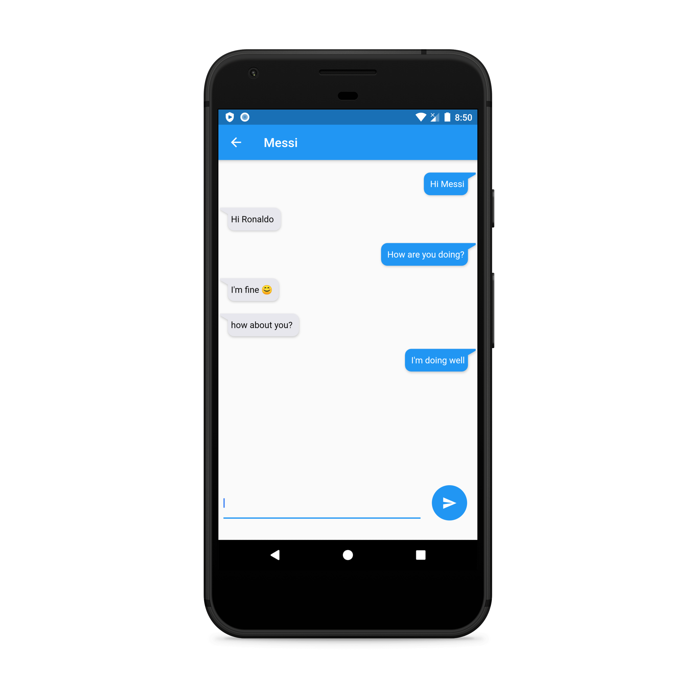
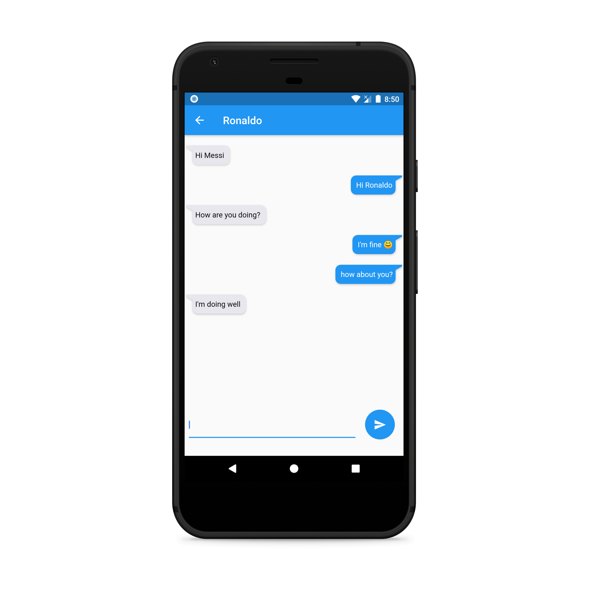
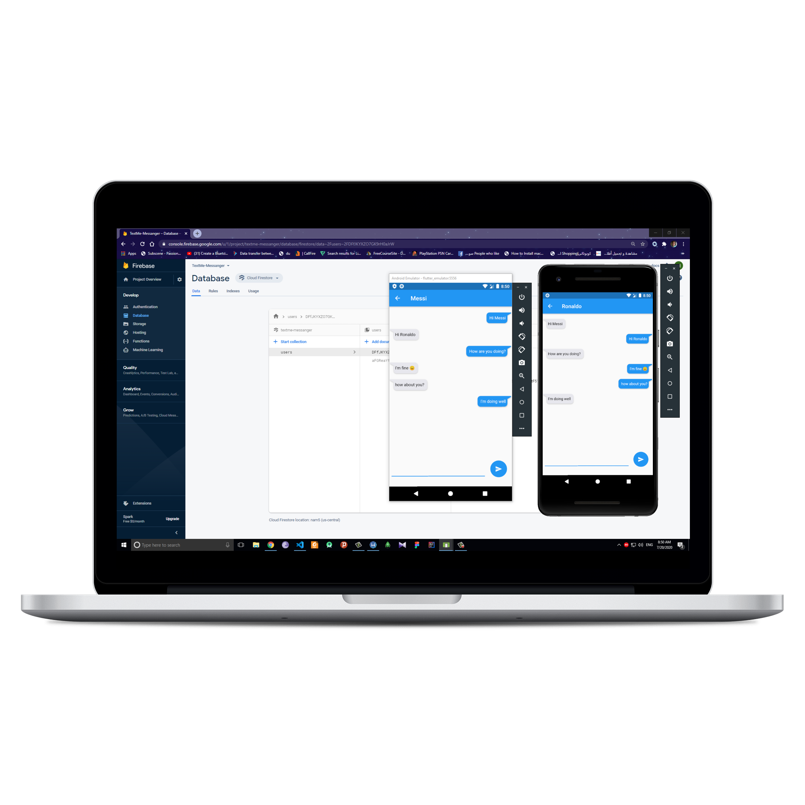

<h1><strong>TextMe-Chat App [Flutter]</strong></h1>

This a real-time chat app build with Flutter and Dart using NodeJs and Firebase as backend.

Please Read Getting started steps at the bottom 👇

<strong>App Features:</strong>

<ul>
<li>Real-time Chat.</li>
<li>Phone Authentication with Firebase.</li>
<li>ScopedModel for State Management.</li>
</ul>

<strong>Requirements:</strong>

<ul>
<li>Pc or Mac.</li>
<li>NodeJs (<a href="https://nodejs.org/en/">https://nodejs.org/en/</a>).</li>
<li>Flutter (<a href="https://flutter.dev/docs/get-started/install">https://flutter.dev/docs/get-started/install</a>).</li>
</ul>

<strong>App Screenshots:</strong>

<strong>Getting started:</strong>

<ul>
<li>Star ⭐ and clone <em>this</em> repo (Flutter app).</li>
<li>Star ⭐ and clone the server repo (Node server.). <a href="https://github.com/musabagab/ChatServer-Node-Sockets">https://github.com/musabagab/ChatServer-Node-Sockets</a> and host it in Heroku or Locally If you want.</li>
<li>Open AppModel.dart<strong> file and replace </strong><em>serverUrl</em> variable value with your server url that you got from step 2.</li>
<li>Go to firebase.google.com, create a new app, and connect it to the flutter app.</li>
<li>Make sure to enable in the Authentication section on the Sign-in Method tab: Sign in provider with Phone and you can use test numbers to test with your emulators.</li>
<li>Enjoy.</li>
</ul>

<strong>Contact me for work at this email: </strong><a href="mailto:musabapps2019@gmail.com"><strong>musabapps2019@gmail.com</strong></a>

